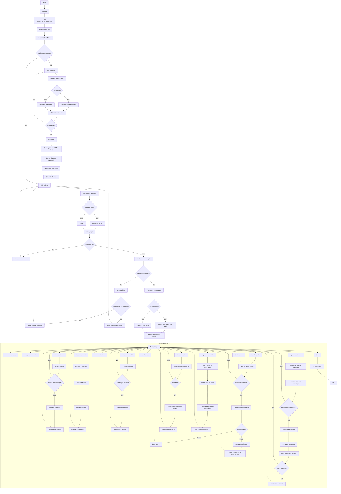

# Fluxograma Complexo

Fluxograma detalhado do projeto **Cofre de Senhas Seguro**, baseado no fluxo atual de `main.py`, `gui.py` e `vault.py`.

```mermaid
flowchart TD
    A[Início] --> B[main.py]
    B --> C[Criar GerenciadorArquivoCofre]
    C --> D[Criar ServicoCofre]
    D --> E[Iniciar interface Tkinter]
    E --> F{Arquivo do cofre existe?}

    F -- Não --> G[Tela de criação]
    G --> H[Informar senha mestra]
    H --> I{Usar keyfile?}
    I -- Sim --> J[Selecionar ou gerar keyfile]
    I -- Não --> K[Prosseguir sem keyfile]
    J --> L[Validar força da senha]
    K --> L
    L --> M{Senha válida?}
    M -- Não --> G
    M -- Sim --> N[criar_cofre]
    N --> O[Criar registro com KDF e verificador]
    O --> P[Derivar chave de criptografia]
    P --> Q[Criptografar cofre vazio]
    Q --> R[Salvar JSON local]
    R --> S[Tela de login]

    F -- Sim --> S

    S --> T[Informar senha mestra]
    T --> U{Cofre exige keyfile?}
    U -- Sim --> V[Selecionar keyfile]
    U -- Não --> W[Seguir]
    V --> X[tentar_login]
    W --> X

    X --> Y{Bloqueio ativo?}
    Y -- Sim --> Z[Mostrar tempo restante]
    Z --> S
    Y -- Não --> AA[Verificar senha e keyfile]
    AA --> AB{Credenciais corretas?}

    AB -- Não --> AC[Registrar falha]
    AC --> AD{Atingiu limite de tentativas?}
    AD -- Não --> AE[Aplicar atraso progressivo]
    AE --> S
    AD -- Sim --> AF[Aplicar bloqueio temporário]
    AF --> S

    AB -- Sim --> AG[Abrir carga criptografada]
    AG --> AH{Formato legado?}
    AH -- Sim --> AI[Migrar cofre para formato atual]
    AH -- Não --> AJ[Manter formato atual]
    AI --> AK[Resetar falhas e abrir sessão]
    AJ --> AK
    AK --> AL[Área principal]

    subgraph SessaoAutenticada [Sessão autenticada]
        AL --> AM[Listar credenciais]
        AL --> AN[Pesquisar por serviço]

        AL --> AO[Nova credencial]
        AO --> AP[Validar campos]
        AP --> AQ{Já existe serviço + login?}
        AQ -- Sim --> AL
        AQ -- Não --> AR[Adicionar credencial]
        AR --> AS[Criptografar e persistir]
        AS --> AL

        AL --> AT[Editar credencial]
        AT --> AU[Carregar credencial]
        AU --> AV[Validar alterações]
        AV --> AW[Salvar alterações]
        AW --> AX[Criptografar e persistir]
        AX --> AL

        AL --> AY[Excluir credencial]
        AY --> AZ[Confirmar exclusão]
        AZ --> BA{Confirmação positiva?}
        BA -- Não --> AL
        BA -- Sim --> BB[Remover credencial]
        BB --> BC[Criptografar e persistir]
        BC --> AL

        AL --> BD[Revelar senha]
        AL --> BE[Copiar senha]
        BD --> BF[Solicitar senha mestra]
        BE --> BF
        BF --> BG{Reautenticação válida?}
        BG -- Não --> AL
        BG -- Sim --> BH[Obter senha da credencial]
        BH --> BI{Ação escolhida}
        BI -- Revelar --> BJ[Exibir senha]
        BI -- Copiar --> BK[Copiar para clipboard]
        BJ --> AL
        BK --> BL[Limpar clipboard após tempo definido]
        BL --> AL

        AL --> BM[Gerar senha forte]
        BM --> AL

        AL --> BN[Fortalecer cofre]
        BN --> BO[Validar senha mestra atual]
        BO --> BP{Autorizado?}
        BP -- Não --> AL
        BP -- Sim --> BQ[Aplicar nova senha e/ou keyfile]
        BQ --> BR[Recriptografar e salvar]
        BR --> AL

        AL --> BS[Exportar credenciais]
        BS --> BT[Definir senha de exportação]
        BT --> BU[Validar força da senha]
        BU --> BV[Criptografar pacote de exportação]
        BV --> BW[Salvar arquivo de backup]
        BW --> AL

        AL --> BX[Importar credenciais]
        BX --> BY[Selecionar arquivo exportado]
        BY --> BZ[Informar senha de importação]
        BZ --> CA{Senha do pacote correta?}
        CA -- Não --> AL
        CA -- Sim --> CB[Descriptografar pacote]
        CB --> CC[Comparar duplicadas]
        CC --> CD[Inserir, atualizar ou ignorar]
        CD --> CE{Houve mudanças?}
        CE -- Não --> AL
        CE -- Sim --> CF[Criptografar e persistir]
        CF --> AL

        AL --> CG[Atualizar tela]
        CG --> AL

        AL --> CH[Sair]
        CH --> CI[Encerrar sessão]
    end

    CI --> CJ[Fim]
```
